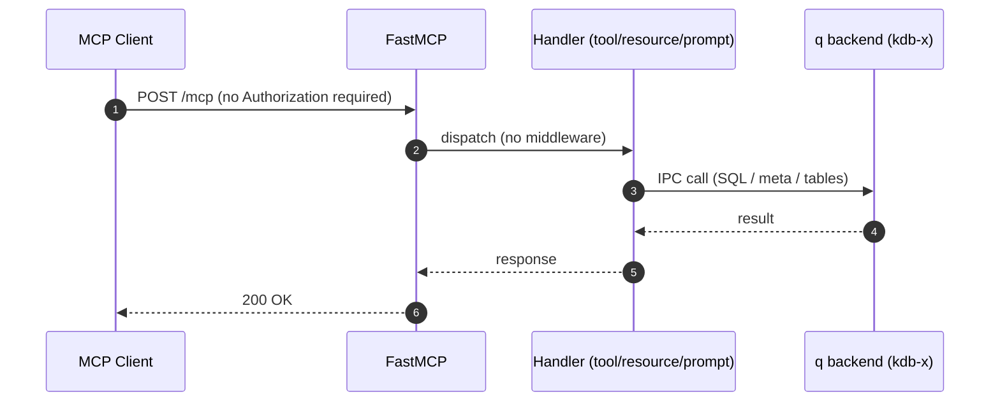

# Authentication spike on this fork

This fork carries a two-commit spike on branch `spike/sdk-bump-auth`
that bumps the MCP SDK and wires JWT bearer-token authentication into
the kdb-x MCP server. This document explains **what** changed in the
fork, **why**, and **how** the three resulting authentication modes
behave at runtime. For the reproduction recipe (key generation, q
startup, server launch, token minting, benchmarks), see
[spike/README.md](spike/README.md).

## TL;DR

- Two commits on `spike/sdk-bump-auth`. Roughly +85 net lines outside
  `spike/` (the actual deliverable) plus the throwaway scaffolding in
  `spike/`.
- The MCP SDK floor moves from `mcp[cli]>=1.2.0` to `>=1.27.0`. The
  realised lockfile bump is 1.13.1 → 1.27.0 — about 14 minor releases,
  not the ~25 the `>=1.2.0` floor implied.
- A new `SPIKE_AUTH` environment variable controls bearer-token
  authentication. The server runs in one of three modes:
  - **unset** (default) — byte-identical to upstream behaviour
  - **`static`** — Layer A: RS256 verified against a local public key
  - **`jwks`** — Layer B: RS256 verified against a remote JWKS endpoint
    (Keycloak / Auth0 / any OIDC issuer). **This is the production
    direction.**
- The validated token reaches application code through the SDK's
  `get_access_token()` contextvar — no `FastMCP` subclass, no ASGI
  patch. The same call works inside tools, resources, and prompts.
- Latency budget is intact: SDK auth ~30–50 µs steady state per call;
  end-to-end `tools/call` p95 stays under ~3 ms in both layers.
- The decision adapter (the layer that turns *authentication* into
  *authorisation*) is **not** part of this spike — code seams marking
  where it lands in round-2 are annotated in the source.

## How to run it

The reproduction recipe — Layer A keypair, q startup, server launch,
token minting, benchmarks — lives in [spike/README.md](spike/README.md).
This document focuses on intent and implementation; the recipe is one
`cd` away.

## What changed (the upstreamable deliverable)

Five files outside `spike/` carry the deliverable.

### 1. SDK bump in `pyproject.toml`

```toml
dependencies = [
    "mcp[cli]>=1.27.0",
    ...
]
```

The MCP SDK's authentication subsystem (`TokenVerifier`,
`RequireAuthMiddleware`, `AuthSettings`, the `get_access_token()`
contextvar) landed in v1.7.0 and stabilised by v1.27.0. The bump
brings in `pyjwt 2.12.1` and `cryptography 48.0.0` as transitive deps,
which the spike's verifiers reuse directly. See the
[footnote](#footnote-build-configuration) for the small ancillary
hatch wheel-target fix in the same file.

### 2. The `SPIKE_AUTH` env-gate in [src/mcp_server/server.py](src/mcp_server/server.py)

A new `_load_spike_token_verifier()` reads `SPIKE_AUTH` and returns
either `(verifier, AuthSettings)` or `(None, None)`. The result is fed
into `FastMCP` only when set, so unset behaviour is unchanged.

```python
def _load_spike_token_verifier():
    """Spike-only: when SPIKE_AUTH=static, return a StaticJWTVerifier + AuthSettings."""
    mode = os.environ.get("SPIKE_AUTH", "").lower()
    if not mode:
        return None, None

    # ... make spike/ importable, read issuer / audience / required_scopes from env ...

    auth_settings = AuthSettings(
        issuer_url=issuer,
        resource_server_url=audience,
        required_scopes=required_scopes,
    )

    if mode == "static":
        from static_jwt_verifier import StaticJWTVerifier
        verifier = StaticJWTVerifier(public_key_path, issuer, audience)
        return verifier, auth_settings

    if mode == "jwks":
        from jwks_verifier import JWKSVerifier
        verifier = JWKSVerifier(jwks_uri=..., issuer=issuer, audience=..., verify_audience=...)
        return verifier, auth_settings

    raise ValueError(f"Unknown SPIKE_AUTH mode: {mode!r}")
```

Wire-up inside `McpServer.__init__` is three lines:

```python
token_verifier, auth_settings = _load_spike_token_verifier()
fastmcp_kwargs = dict(port=..., host=...)
if token_verifier is not None:
    fastmcp_kwargs["token_verifier"] = token_verifier
    fastmcp_kwargs["auth"] = auth_settings
self.mcp = FastMCP(self.mcp_config.server_name, **fastmcp_kwargs)
```

Two small details from the spike worth recording for round-2:

- `AuthSettings.resource_server_url` and `issuer_url` are
  **URL-validated** by pydantic. A bare identifier like `mcp-spike` is
  rejected; `https://localhost:8000/mcp` is accepted.
- The 401 response on a missing/invalid token is **spec-compliant out
  of the box**. The SDK's `RequireAuthMiddleware` emits a
  `WWW-Authenticate: Bearer` header with the RFC 9728
  `resource_metadata` URL pointing at the `.well-known/oauth-protected-resource`
  endpoint. No application code is required to produce this.

Full source: [src/mcp_server/server.py:18-99](src/mcp_server/server.py#L18-L99).

### 3. Surfacing the principal in the SQL tool

The load-bearing demonstration of the spike: the validated token
reaches application code via a single SDK import, with no FastMCP
subclass and no ASGI patch.

```python
# Inside kdbx_run_sql_query, after the request reaches the handler:
from mcp.server.auth.middleware.auth_context import get_access_token
tok = get_access_token()
if tok is not None:
    logger.info(
        f"SPIKE: tool called by client_id={tok.client_id!r} "
        f"scopes={tok.scopes!r} resource={tok.resource!r}"
    )
```

Source: [src/mcp_server/tools/kdbx_run_sql_query.py:80-91](src/mcp_server/tools/kdbx_run_sql_query.py#L80-L91).

When the server runs with `SPIKE_AUTH=static` and receives a valid
token, the log line on a successful `tools/call` reads:

```
SPIKE: tool called by client_id='spike-client' scopes=['kdbx.read'] resource='https://localhost:8000/mcp'
```

That confirms the verified `AccessToken` is reachable at the point
where authorisation decisions need to be made — the foundation for
round-2's decision-adapter call.

### 4–5. Same pattern across resources and prompts

The second commit on the branch extends the principal-logging pattern
to the other two MCP primitives, proving the SDK auth path is uniform
across all of them.

**Resource handler** at [src/mcp_server/resources/kdbx_database_tables.py:120-145](src/mcp_server/resources/kdbx_database_tables.py#L120-L145):

```python
@mcp_server.resource("kdbx://tables")
async def kdbx_describe_tables() -> List[TextContent]:
    # ... same get_access_token() block ...
    logger.info(
        f"SPIKE: resource 'kdbx://tables' read by client_id={tok.client_id!r} "
        f"scopes={tok.scopes!r} resource={tok.resource!r}"
    )
    return await kdbx_describe_tables_impl()
```

**Static-content resource** at [src/mcp_server/resources/kdbx_sql_query_guidance.py:11-37](src/mcp_server/resources/kdbx_sql_query_guidance.py#L11-L37) gets the same hook for completeness (no Layer 2 work
expected on static documentation).

**Prompt handler** at [src/mcp_server/prompts/kdbx_table_analysis.py:86-119](src/mcp_server/prompts/kdbx_table_analysis.py#L86-L119) — same import, same call, plus the prompt's invocation
arguments are also logged alongside the principal:

```
SPIKE: prompt 'kdbx_table_analysis' fetched by client_id='spike-client'
       scopes=['kdbx.read'] args=(table_name='trades', analysis_type='statistical')
```

The decision-adapter call shape is uniform across the three primitives —
Subject / Action / Resource where `Action ∈ {tool_invoke, resource_read, prompt_get}` —
so no new authorisation vocabulary needs to be invented for round-2.

## The spike scaffolding

The [spike/](spike/) directory holds the throwaway test harness used
to validate the design. It will not upstream as-is; in round-2 the
verifier classes move to a proper `mcp_server/auth/` package, and the
keys / q-startup / benchmark code lives in deployment docs rather than
the repo.

| File | Lines | Role |
|---|---|---|
| [`static_jwt_verifier.py`](spike/static_jwt_verifier.py) | 44 | Layer A `TokenVerifier`. RS256 against a local PEM, read once at init. |
| [`jwks_verifier.py`](spike/jwks_verifier.py) | 64 | Layer B `TokenVerifier`. RS256 against a remote JWKS via `jwt.PyJWKClient` (keys cached, refetched on `kid` miss). |
| [`mint_token.py`](spike/mint_token.py) | 45 | CLI that signs Layer A test tokens with the local private key. |
| [`bench.py`](spike/bench.py) | 210 | Verifier-only and end-to-end (`tools/call` round-trip) latency benchmarks. |
| [`q_startup.q`](spike/q_startup.q) | 6 | Spike q process: `use\`kx.sql` plus `trades` and `quotes` test tables. |
| [`run_server.py`](spike/run_server.py) | 11 | Launcher that prepends `src/` to `sys.path` — see [footnote](#footnote-build-configuration). |
| `keys/` | — | RSA keypair for Layer A. **Gitignored.** Regenerate locally; the recipe is in [spike/README.md](spike/README.md). |
| [`README.md`](spike/README.md) | — | Reproduction recipe: keys, q, server launch, token minting, benchmarks. |

Both verifier classes implement the SDK's `TokenVerifier` protocol
from `mcp.server.auth.provider`; the SDK middleware doesn't care
which one is plugged in. **That is the "IdP-independent" property in
running code** — the JWKS verifier was validated against Navikt's
[mock-oauth2-server](https://github.com/navikt/mock-oauth2-server) in
the spike, but it works against any OIDC-compliant issuer (Keycloak,
Auth0, Okta, etc.) without code changes — only configuration.

## AUTH modes — sequence diagrams

Three sequence diagrams, one per `SPIKE_AUTH` mode. Each shows the
full request path: client through middleware through verifier through
handler through q backend.

### Mode 1: `SPIKE_AUTH` unset (default — upstream behaviour)

`_load_spike_token_verifier()` returns `(None, None)`, no `auth`
kwarg is passed to `FastMCP`, and no authentication middleware is
installed. The request path is identical to upstream.



### Mode 2: `SPIKE_AUTH=static` (Layer A — local public key)

The verifier reads `spike/keys/spike_public.pem` once at server
startup. Token validation is pure local crypto — no network calls per
request, ever. Useful for spike validation and for offline development
without standing up an IdP.

```mermaid
sequenceDiagram
  autonumber
  participant Mint as Test-token mint
  participant C as MCP Client
  participant F as FastMCP
  participant M as RequireAuthMiddleware
  participant V as StaticJWTVerifier
  participant Ctx as auth_context_var
  participant H as Handler
  participant Q as q backend

  Note over Mint,V: Server startup — StaticJWTVerifier reads PEM from disk; FastMCP installs RequireAuthMiddleware.
  Mint->>C: signs RS256 JWT with local private key
  C->>F: POST /mcp with Bearer JWT
  F->>M: incoming request
  M->>V: verify_token(jwt)
  V->>V: RS256 verify (local pubkey), check iss + aud
  alt valid
    V-->>M: AccessToken(client_id, scopes, resource, exp)
    M->>Ctx: set AccessToken
    M->>H: dispatch
    H->>Ctx: get_access_token()
    Ctx-->>H: AccessToken
    H->>Q: IPC call
    Q-->>H: result
    H-->>F: response
    F-->>C: 200 OK
  else invalid / missing
    V-->>M: None
    M-->>C: 401 with WWW-Authenticate Bearer + resource_metadata (RFC 9728)
  end
```

### Mode 3: `SPIKE_AUTH=jwks` (Layer B — remote JWKS, production direction)

The verifier holds a `PyJWKClient` configured with the IdP's
`jwks_uri`. The first verification triggers a synchronous HTTP fetch
of the JWKS document; subsequent verifications use the cached keys,
indexed by `kid`. If a token presents an unknown `kid` (key rotation),
the JWKS is refetched.

This is the shape a real resource server takes against a real IdP.
The spike validates against Navikt's mock-oauth2-server running in
Docker, but the same code runs unchanged against Keycloak / Auth0 /
Okta — only the env vars change.

```mermaid
sequenceDiagram
  autonumber
  participant C as MCP Client
  participant I as OIDC IdP (Keycloak / Navikt / Auth0)
  participant F as FastMCP
  participant M as RequireAuthMiddleware
  participant V as JWKSVerifier
  participant J as PyJWKClient (in-process cache)
  participant Ctx as auth_context_var
  participant H as Handler
  participant Q as q backend

  Note over C,J: Server startup — JWKSVerifier created; PyJWKClient instantiated but JWKS not yet fetched.
  C->>I: POST /token (client_credentials, scope=kdbx.read)
  I-->>C: access_token (RS256 JWT with kid)
  C->>F: POST /mcp with Bearer JWT
  F->>M: incoming request
  M->>V: verify_token(jwt)
  V->>J: get_signing_key_from_jwt(jwt)
  alt cold or kid not cached
    J->>I: GET jwks_uri
    I-->>J: JWKS document
    J->>J: cache keys by kid
  else warm
    Note right of J: cache hit
  end
  J-->>V: signing key
  V->>V: RS256 verify + check iss
  alt valid
    V-->>M: AccessToken(client_id, scopes, resource, exp)
    M->>Ctx: set AccessToken
    M->>H: dispatch
    H->>Ctx: get_access_token()
    Ctx-->>H: AccessToken
    H->>Q: IPC call
    Q-->>H: result
    H-->>F: response
    F-->>C: 200 OK
  else invalid
    V-->>M: None
    M-->>C: 401 with WWW-Authenticate Bearer (RFC 9728)
  end
```

## Latency

Measured on Scott's box during the spike: 100 samples per measurement,
10 warm-ups discarded, end-to-end is a full `tools/call` round-trip
through the SDK middleware, the tool function, and q over IPC.

| Metric | Layer A (static) | Layer B (JWKS, loopback Docker IdP) |
|---|---|---|
| Verifier cold (1st call) | 0.767 ms | 9.292 ms (includes JWKS fetch) |
| Verifier warm p50 | 0.049 ms | 0.030 ms |
| Verifier warm p95 | 0.053 ms | 0.060 ms |
| End-to-end p50 | 1.930 ms | 2.032 ms |
| End-to-end p95 | 2.131 ms | 2.771 ms |
| End-to-end max | 2.396 ms | 5.815 ms |

The SDK auth subsystem is essentially free in steady state (~30–50 µs
per call). The interesting cost — the JWKS fetch on cold or key
rotation — sits at ~9 ms over loopback Docker, comparable to a real
network IdP under low contention. End-to-end p95 under ~3 ms in both
layers leaves room for the decision-adapter's per-call check in
round-2 without breaking the latency budget the doc-set sets.

## Layer 2 seams (round-2 work, marked in code)

The spike validates Layer 1 (authentication: who is calling) across
all three MCP primitives. Layer 2 (authorisation: what they may do)
is the decision-adapter call that turns the validated `AccessToken`
into an allow / deny answer. Three seams are already marked in the
source — all using the same Subject / Action / Resource shape:

1. **Resource-list filter** at [src/mcp_server/resources/kdbx_database_tables.py:75-89](src/mcp_server/resources/kdbx_database_tables.py#L75-L89).
   The decision adapter filters `conn.tables(None)` by per-table read
   entitlement before iteration. **This is the demo amplifier** —
   the agent sees only its allowed tables in the schema overview,
   rather than receiving a 403 when it tries to query a table it
   wasn't supposed to know about.
2. **Per-prompt entitlement check** at [src/mcp_server/prompts/kdbx_table_analysis.py:102-106](src/mcp_server/prompts/kdbx_table_analysis.py#L102-L106).
   `decide(subject, "prompt_get", "kdbx_table_analysis")` gates the
   prompt fetch.
3. **Per-tool decision call** alongside the principal log at [src/mcp_server/tools/kdbx_run_sql_query.py:80-91](src/mcp_server/tools/kdbx_run_sql_query.py#L80-L91).
   Currently logs the principal; round-2 inserts
   `decide(subject, "tool_invoke", "kdbx_run_sql_query")` before the
   SQL runs.

The intended audit row per decision is principal + on-behalf-of +
action + resource + decision + timestamp — uniform across primitives.

## What this fork is not

- **Not a production auth implementation.** `SPIKE_AUTH` is
  feature-gated spike code on a non-default branch. Round-2 lifts the
  verifier classes into a proper `mcp_server/auth/` package and drops
  the env-gate.
- **Not a decision adapter.** The PEP layer
  (`decide(subject, action, resource)`) is round-2 work; this spike
  validates the wire-up underneath it.
- **Not a token-exchange story.** RFC 8693 delegation (so the MCP
  server can mint a backend-scoped token from the inbound one) lives
  elsewhere — in the `kx auth` agent.
- **Not an audit-log shape.** The spike logs principal as a sanity
  demo; the formal R7-shaped audit record is round-2.
- **Not opinionated about stdio.** `SPIKE_AUTH` only meaningfully
  applies to the `streamable-http` transport; stdio is out of scope.

## Round-2 path

The end-state of the spike is a `mcp_server/auth/` package whose
public shape is approximately:

- A `TokenVerifier` implementation parameterised by issuer / JWKS /
  required scopes (no env-gate; configuration via existing settings
  channels).
- A decision adapter interface invoked by every primitive handler at
  the seams above.
- A structured audit logger consuming the principal + decision + R7
  context.
- A token-exchange handoff to the backend identity layer (out of this
  repo).

The shape of `_load_spike_token_verifier()` in this fork is roughly
what `mcp_server/auth/__init__.py` should look like in the round-2 PR,
just with the decision-adapter / RFC 8693 / audit pieces layered on
top.

## Footnote: build configuration

This fork also carries a one-line ancillary fix in [pyproject.toml](pyproject.toml):

```toml
[tool.hatch.build.targets.wheel]
packages = ["src/mcp_server"]
```

Without this wheel-target declaration, `uv pip install -e .` builds
a dist-info-only wheel and `mcp_server` is not importable from the
project's venv. The fix is upstreamable on its own and unrelated to
authentication; [spike/run_server.py](spike/run_server.py) is a
launcher that works around the missing target by prepending `src/` to
`sys.path` directly, which is useful when working from a checkout
that doesn't have the fix applied.
